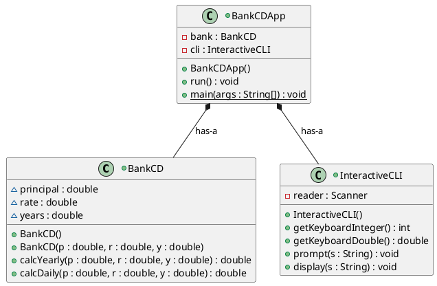
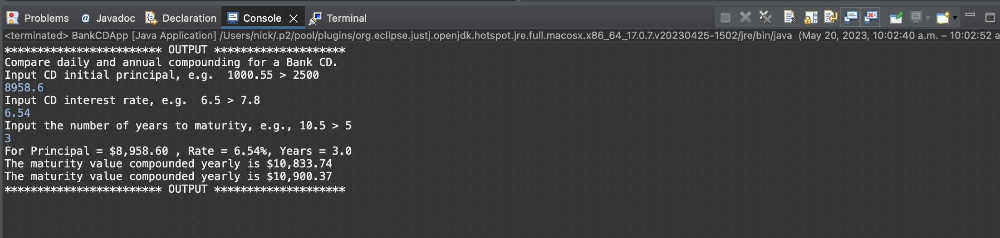
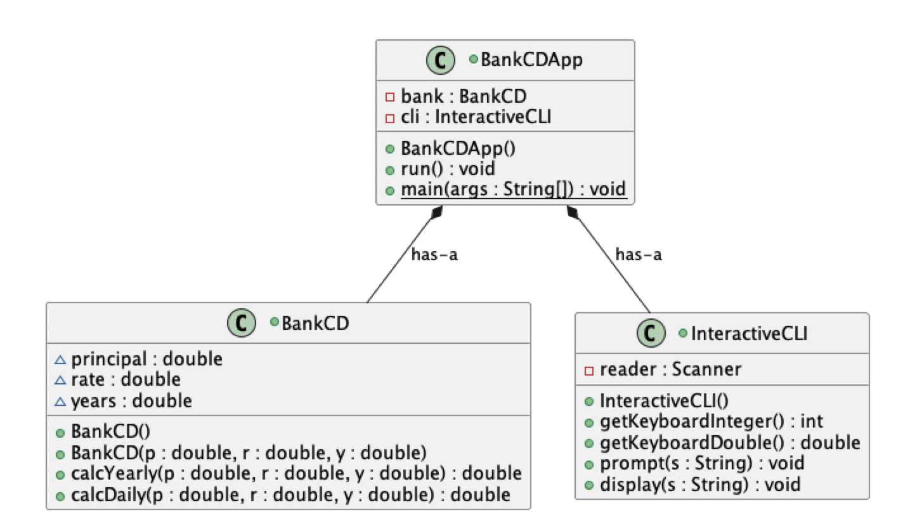

# Days in Month report
Author: Nick Nikolov

## UML class diagram

## Execution and Testing
This screenshot shows successful execution and test of the BankCDApp

This screenshot shows the BankCDApp UML diagram

# Reflection
I liked that the goal of the assignment was clear, I understood the problem and the purpose of solving it. Easy to visualize real world examples. The most challenging part was I kept getting a nullpointer error in the BankCDApp.java file. I didn't realize I had to create a new BankCD object, since I thought the first line "private BankCD bank;" would initialize a BankCD object. After initializing the object, everything was simple.
