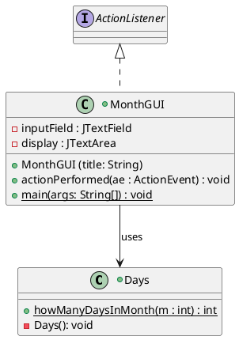
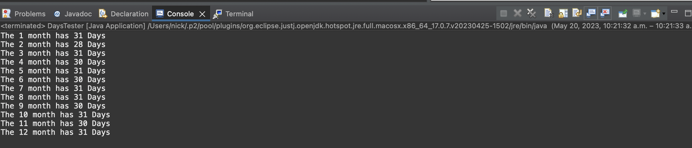
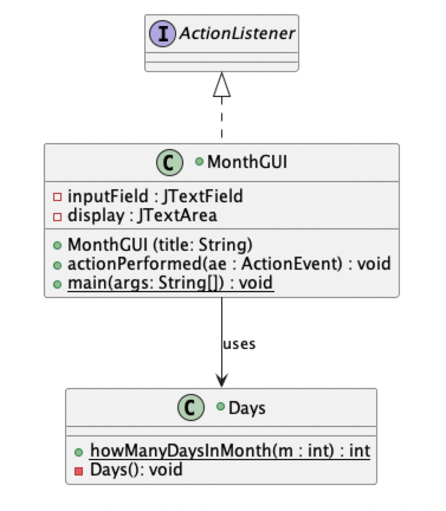
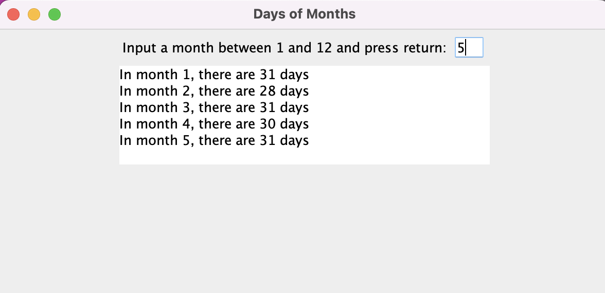

# Days in Month report
Author: Nick Nikolov

## UML class diagram

## Execution and Testing

**Testing `Days` class**

This screenshot shows successful execution of the DaysTester file

This screenshot shows the UML diagram of the Days application 

**Days in Month GUI Usage**

Input the number of the month between 1 to 12 inclusive (1 = January, 12 = December)
hit the enter key on the keyboard

The screen will output the number of days in the month that you input

To enter another month, delete the previous number you input, and input another number between 1 - 12, press enter when ready
